<div align="center">


# Ordinaryunus

**Obsidian kasanı, yapay zekâ ekibini ve onayını bekleyen kararları tek ekranda toplayan, şifreli bir Windows masaüstü uygulaması.**

[](EK-SARTLAR.md)
[](#gereksinimler)
[](https://dotnet.microsoft.com/download/dotnet/10.0)

[Hızlı başlangıç](#hızlı-başlangıç) · [Özellikler](#neler-yapar) · [Kendi kasanı bağla](#kendi-kasanı-bağlama) · [Güvenlik](#güvenlik-ve-gizlilik) · [Mimari](belgeler/MIMARI.md)

</div>

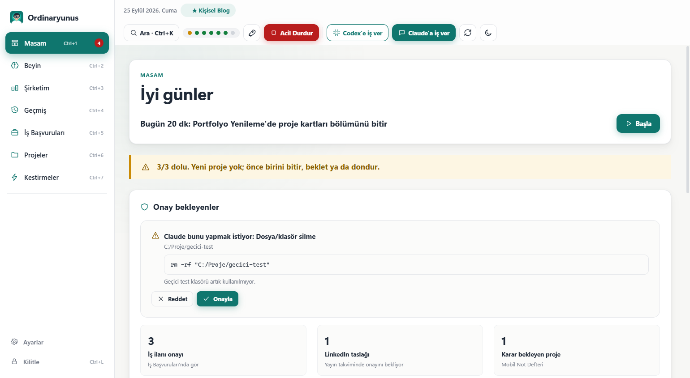

## Neden yaptım?

Notlarımı Obsidian'da bir "ikinci beyin" olarak tutuyorum. İşlerimi de Claude, Codex ve Gemini ile yürütüyorum.
Bir noktada şunu fark ettim: kime ne dediğimi, bir işin nerede kaldığını, hangi yapay zekânın neyi bozduğunu artık
takip edemiyordum. Birkaç sohbet penceresi, birkaç ayrı geçmiş, bir kasa dolusu not vardı ama resmin tamamını gösteren
bir yer yoktu.

Bu yüzden kendime tek ekranlık bir yönetim masası yazdırdım. Kurduğum düzen basit: **patron benim, genel müdür Claude,
mühendisler Codex ve Claude'un alt ajanları.** Ordinaryunus da bu küçük şirketin masası:

- Sabah açtığımda günün **tek işini** ve **onayımı bekleyen kararları** görüyorum.
- Yapay zekâ bir dosyayı silmek ya da riskli bir komut çalıştırmak isterse bunu kendi başına yapamıyor; önüme bir
  **onay kartı** düşüyor (Onayla / Reddet). İşler çığırından çıkarsa kırmızı **Acil Durdur** düğmesi var.
- "Claude'a iş ver" dediğimde iş arka planda **gerçekten başlıyor**. Kullanım limiti dolarsa bekliyor, limit açılınca
  **kaldığı yerden devam ediyor**. Uygulamayı kapatsam bile.
- **Beyin** sayfası bütün notlarımı ve projelerimi tek haritada gösteriyor, hangi projenin tıkandığını söylüyor.
- Bu uygulamanın kodunu da aynı düzenle yazdırdım: Claude yazdı, Codex denetledi, kararları ben verdim.

Uygulama tamamen bilgisayarımda, yerelde çalışıyor ve şifreyle açılıyor. LinkedIn'de anlattığımda "isteyen olursa açık
kaynak paylaşırım" demiştim; epey kişi istedi. İşte burada. **Kendi kasanla kullanabilmen için** bütün kişisel bilgileri
çıkardım, yerine uydurma projelerle dolu bir örnek kasa (`ornek-kasa`) koydum.

## Neler yapar?

Uygulama bir Obsidian kasasını (içinde Markdown notları olan sıradan bir klasörü) okur ve sayfalara böler:

| Sayfa | Ne gösterir, ne yaptırır |
|---|---|
| **Masam** (Ctrl+1) | Selamlama ve günün tek işi (Başla → odak sayacı). Onayını bekleyen güvenlik istekleri (Onayla / Reddet). `01 Şimdi.md` içindeki **Yapılacaklarım** listesi: tıklayınca kutucuk kasada işaretlenir. Projelerin **senden beklediği** kararlar ve işler. "Günü kapat". |
| **Beyin** (Ctrl+2) | Dört sekme. **Genel bakış**: kurallarla yazılmış kısa durum özeti, sağlık puanı, göstergeler ve grafikler. **Keşfet**: kasa ağacı, güvenli not okuyucu, gelen ve giden bağlantılar. **Harita**: bütün notların bağlantı grafiği. **Sorunlar**: kırık bağlantı, süresi geçen proje, bekleyen karar gibi 18 kuralın bulduğu sorunlar ve her biri için "Ne yapmalı". |
| **Şirketim** (Ctrl+3) | Çalışan yapay zekâ işleri: canlı durum, adım sayısı, Detay ve Durdur. Kota bekleyen işler için geri sayım ve "Şimdi dene". Açık Claude oturumları. `60 Ekip/Roller` altındaki roller ve her rol için "İş ver". |
| **Geçmiş** (Ctrl+4) | Son 30 gün: kasa kayıtları (git), Claude'a ve Codex'e yazdıkların (istek defteri), biten görevler ve işler. Filtre ve arama. |
| **İş Başvuruları** (Ctrl+5) | `40 Alanlar/İş Başvuruları.md` tablosu. "Onay bekliyor" satırlarını işaretleyip tek düğmeyle onaylarsın. |
| **Projeler** (Ctrl+6) | Her proje kartı: durum, ilerleme halkası, bırakma tarihine kalan gün, sıradaki adım, engel. |
| **Kestirmeler** (Ctrl+7) | Tek tıkla: `01 Şimdi`'yi Obsidian'da aç, kasa klasörü, Claude ve Codex uygulamaları, istek defterini tara, güvenlik kapısını dene. İsteğe bağlı: `/devir` ve `/haftalik` komutlarını kopyalayıp Claude'u aç (bunlar depoyla gelen örnek Claude Code becerileridir, önce kurman gerekir: [KURULUM.md 3.6](kasa-araclari/KURULUM.md#36-devir-ve-haftalik-becerileri-isteğe-bağlı)). |
| **Ayarlar** | Kasa klasörü, açık ve koyu tema, ekran boyutu (%100 ile %175 arası), hareketler, kilit süresi, şifre değiştirme, "İş varken bilgisayar uyumasın", bağlı araçların durumu, Hakkında (sürüm ve lisans). |

Üst çubukta her an şunlar var: **Claude'a iş ver**, **Codex'e iş ver**, **Acil Durdur** (tekrar basınca "Devam Et"),
**Tam Gaz**, arama (Ctrl+K) ve sistem ışıkları (Claude, Codex, Obsidian, kasa, güvenlik kapısı, kota; üzerine gelince ne
demek olduğunu yazar).

### Ekran görüntüleri

| | |
|---|---|
| 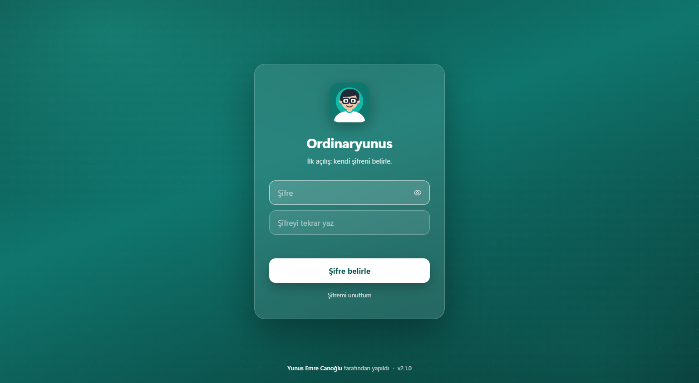 | 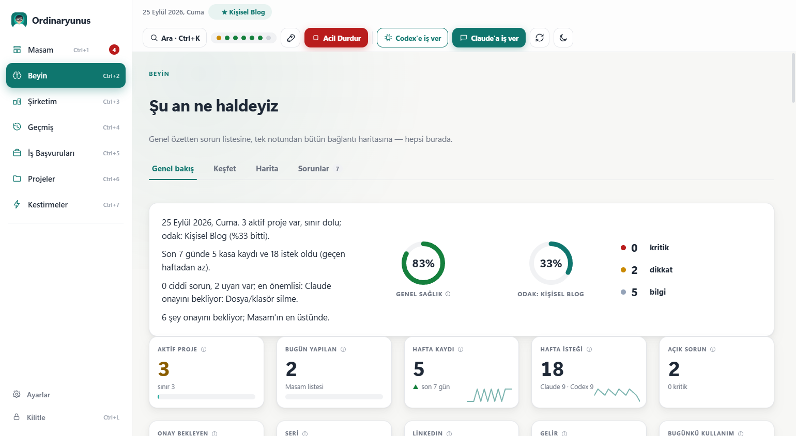 |
| **Giriş:** ilk açılışta kendi şifreni belirlersin. | **Beyin › Genel bakış:** kasanın durumu, sağlık puanı, grafikler. |
| 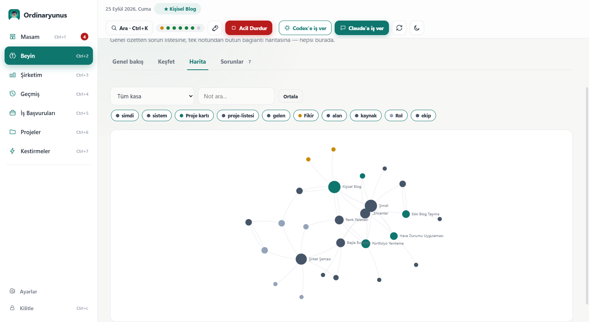 | 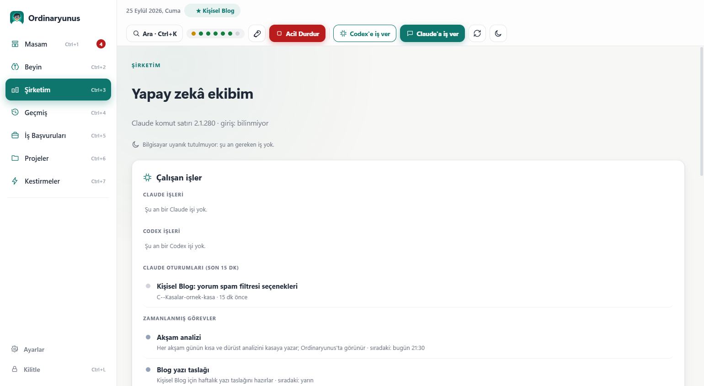 |
| **Beyin › Harita:** bütün notlar ve bağlantıları tek grafikte. | **Şirketim:** yapay zekâ işleri ve roller. |

<details>
<summary><b>Diğer ekranlar</b> (12 görüntü)</summary>

| | |
|---|---|
| 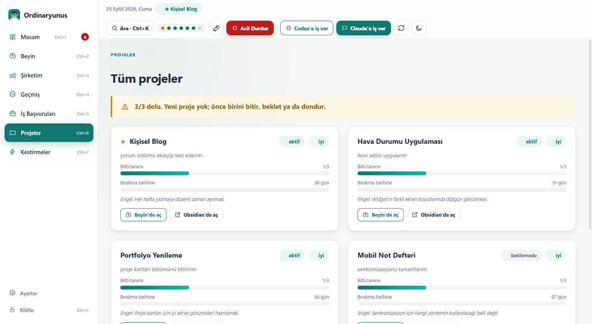 | 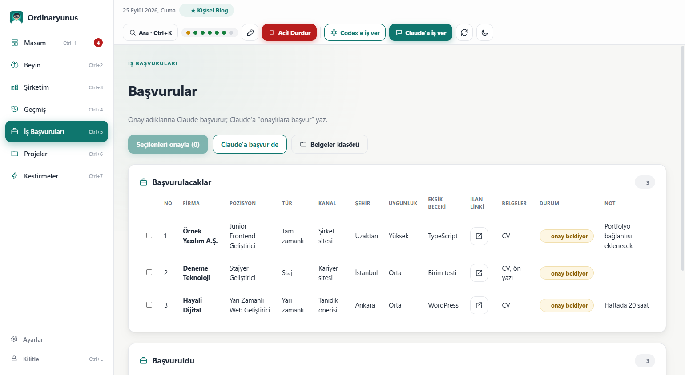 |
| **Projeler:** her proje kartı, ilerleme, bırakma tarihine kalan gün. | **İş Başvuruları:** onay bekleyen ilanları seçip onaylarsın. |
| 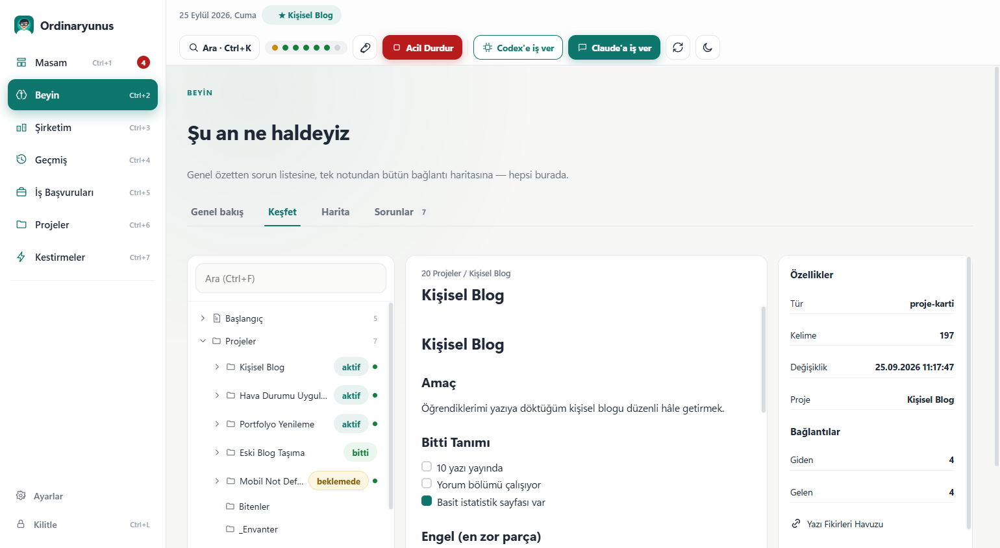 | 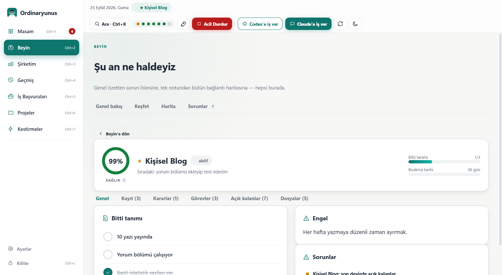 |
| **Beyin › Keşfet:** kasa ağacı, güvenli not okuyucu, gelen ve giden bağlantılar. | **Beyin › Proje:** sağlık puanı, bitti tanımı, devirler, kararlar, görevler. |
| 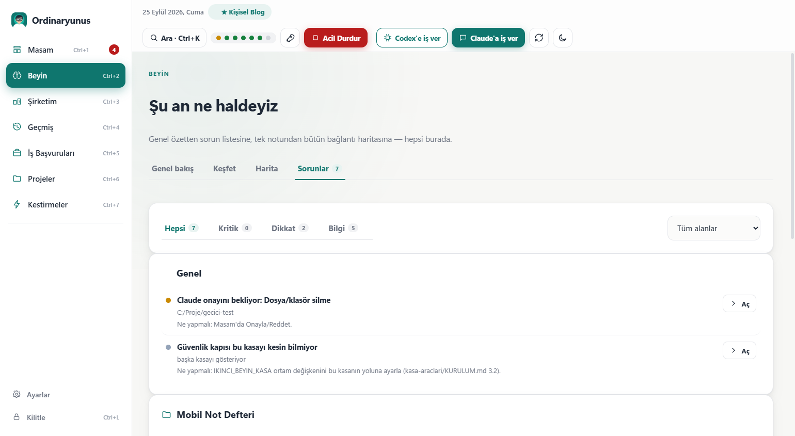 | 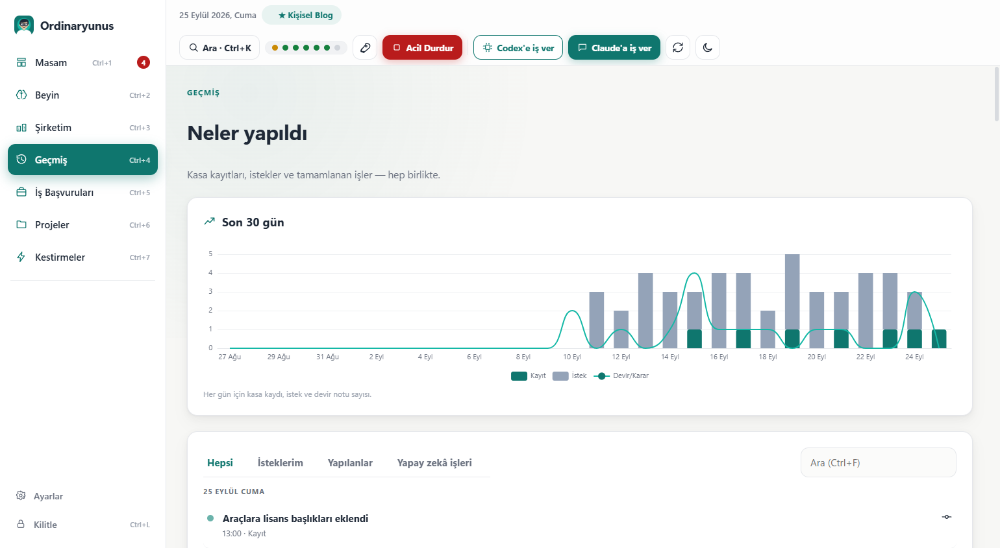 |
| **Beyin › Sorunlar:** kuralların bulduğu sorunlar ve her biri için "Ne yapmalı". | **Geçmiş:** son 30 günün kayıtları, istekleri ve işleri. |
| 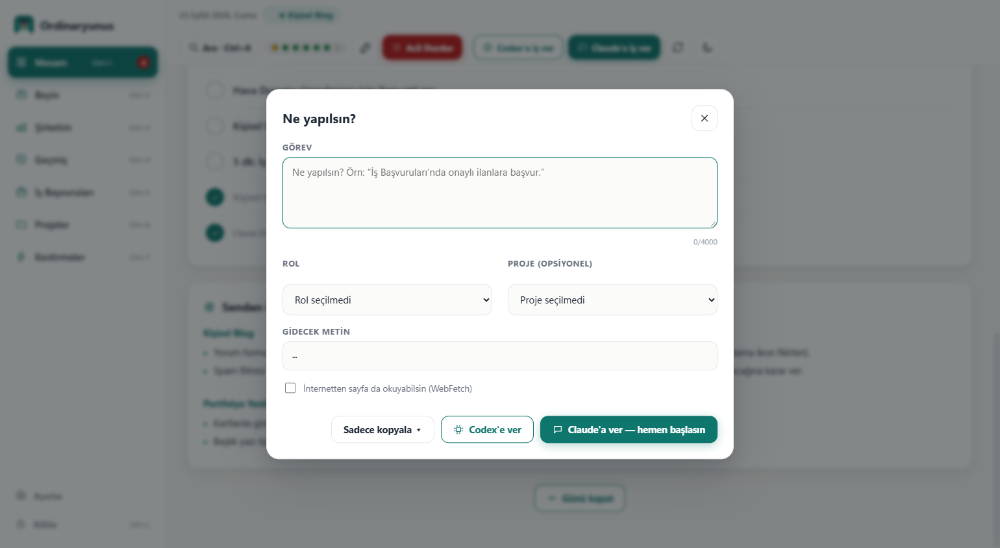 | 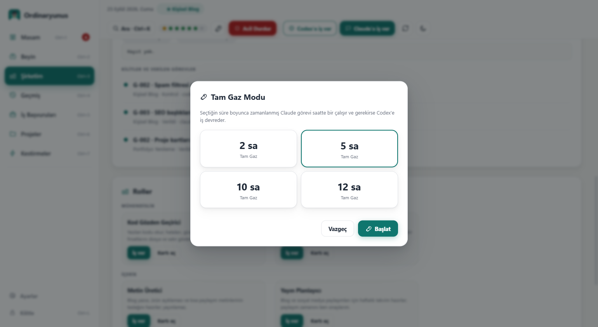 |
| **İş ver:** Claude'a ya da Codex'e iş; rol ve proje seçimi. | **Tam Gaz:** "ben yokken çalışın" anahtarı. |
| 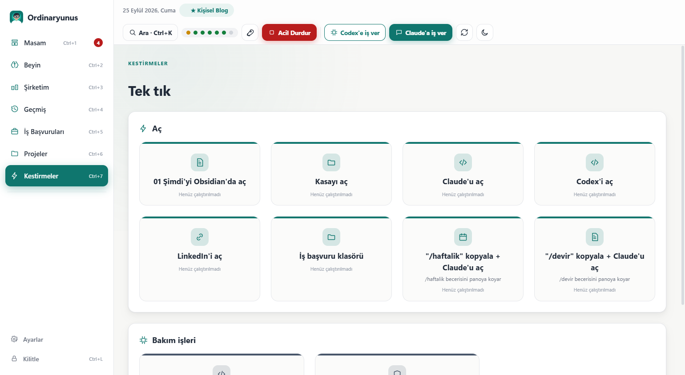 | 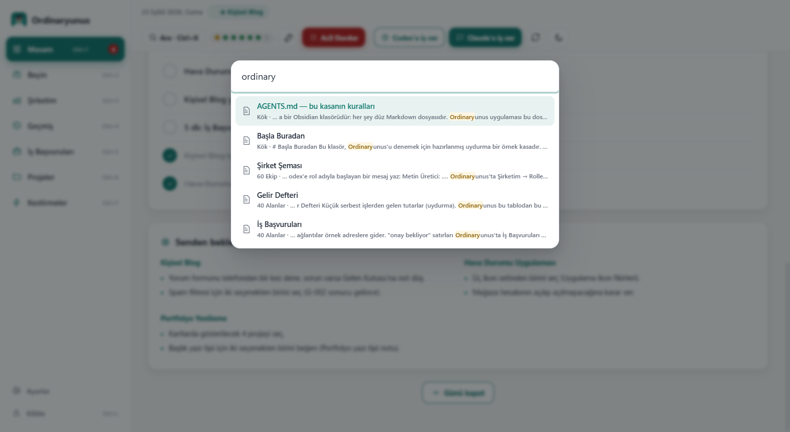 |
| **Kestirmeler:** tek tıkla açma ve bakım işleri. | **Arama (Ctrl+K):** sayfalar ve kasa içinde arama. |
| 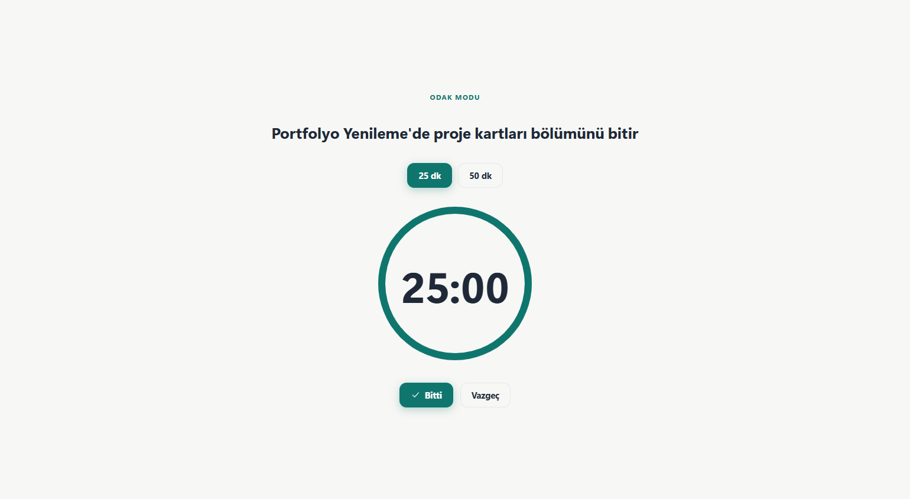 | 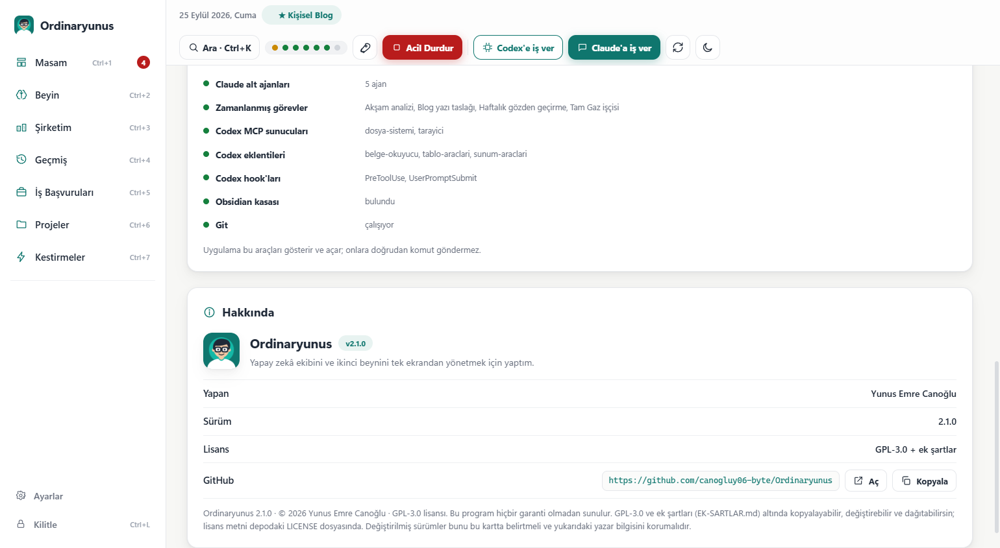 |
| **Odak modu:** günün tek işi için sayaç. | **Ayarlar:** kasa, tema, ekran boyutu, bağlantılar, Hakkında. |

</details>

Görüntüler `ornek-kasa` ile alındı; içindeki projeler ve kişiler uydurmadır.

## Hızlı başlangıç

### A) Hazır sürüm (önerilen)

1. [Releases](https://github.com/canogluy06-byte/Ordinaryunus/releases) sayfasından `Ordinaryunus-2.1.0-win-x64.zip`
   dosyasını indir ve bir klasöre çıkar (örneğin `C:\Araclar`). Zip'in içinden `Ordinaryunus` klasörü çıkar
   (`C:\Araclar\Ordinaryunus`); içinde `BASLAT.bat`, `yayin\` (uygulama), `ornek-kasa\` ve `kasa-araclari\` var.
2. `BASLAT.bat` dosyasına çift tıkla.
3. **İlk açılışta** kendi şifreni belirle (en az 6 karakter, iki kez yazılır).
4. Uygulama zip içindeki `ornek-kasa` ile açılır. Uydurma projelerle her sayfayı rahatça gezebilirsin.

> Windows "Bilgisayarınız korundu" (SmartScreen) uyarısı gösterebilir, çünkü uygulama imzalı değil.
> **Ek bilgi → Yine de çalıştır** ile açabilirsin. Emin olmak istersen kaynaktan kendin derle (aşağıda B).

#### Gereksinimler

| Gerekli | Neden | Nereden |
|---|---|---|
| Windows 10 ya da 11 (64 bit) | Uygulama sadece Windows'ta çalışır. | |
| .NET 10 Masaüstü Çalışma Zamanı (x64) | Uygulama bunun üstünde çalışır ("Windows Desktop Runtime" olarak geçer). | [dotnet.microsoft.com](https://dotnet.microsoft.com/download/dotnet/10.0) |
| Microsoft Edge WebView2 Runtime | Arayüzü çizer. Windows 11'de hazır gelir; eksikse uygulama söyler. | [developer.microsoft.com](https://developer.microsoft.com/microsoft-edge/webview2/) |

İstersen ekleyebileceklerin:

| Seçmeli | Ne kazandırır |
|---|---|
| [Git](https://git-scm.com) | Kasa bir git deposuysa Geçmiş sayfası, kayıt grafikleri ve "Kasa" ışığı dolar. |
| [Node.js](https://nodejs.org) (LTS, `PATH` içinde) | Yapay zekâya uygulamadan iş verme (iş nöbetçisi) ve Claude Code kancaları bununla çalışır. |
| [Obsidian](https://obsidian.md) | Notları açıp düzenlemek için. "Obsidian'da aç" düğmeleri bunu kullanır. |
| Claude masaüstü uygulaması (Claude Code ile) | "Claude'a iş ver". Ayrıntı [aşağıda](#claude-ve-codex-ile-iş-verme). |
| Codex masaüstü uygulaması (ya da Codex komut satırı) | "Codex'e iş ver". |

### B) Kaynaktan derle

[.NET 10 SDK](https://dotnet.microsoft.com/download/dotnet/10.0) gerekir. Depo kökünde:

```powershell
git clone https://github.com/canogluy06-byte/Ordinaryunus.git
cd Ordinaryunus
dotnet publish Ordinaryunus\Ordinaryunus.csproj -c Release -r win-x64 --self-contained false -p:PublishSingleFile=true -o yayin
.\BASLAT.bat
```

Çıktı `yayin\` klasörüne gider: tek dosyalık `Ordinaryunus.exe`, yanında arayüz dosyaları (`wwwroot\`) ve
`WebView2Loader.dll`. İlk derlemede NuGet'ten `Microsoft.Web.WebView2` paketi indirilir; başka paket yok.

## Kendi kasanı bağlama

Ordinaryunus'un gücü kendi notlarınla ortaya çıkar. Adım adım kurulum [kasa-araclari/KURULUM.md](kasa-araclari/KURULUM.md)
dosyasında. Kısaca:

1. **Kasa**, içinde Markdown notları olan bir klasördür. Uygulama belli klasör ve dosya adlarına bakar:
   `01 Şimdi.md` (içinde `## ✅ Yapılacaklarım` bölümü), `20 Projeler/<Proje>/<Proje>.md` (proje kartı),
   `20 Projeler/<Proje>/Kayıt.md` ve `Görevler/`, `60 Ekip/Roller/`, `40 Alanlar/İş Başvuruları.md`, `70 Günlük/`,
   `_sistem/`. En kolay yol `ornek-kasa`'yı kopyalayıp içini kendine göre değiştirmek.
2. Kasanın kökünde bir **`AGENTS.md`** olmalı. Bu dosya yapay zekâlara kasanın kurallarını anlatır; uygulama da
   Ayarlar'dan seçtiğin klasörü kasa olarak bununla tanır.
3. Kasayı bir **git** deposu yaparsan (`git init` ve düzenli commit) Geçmiş ve grafikler dolar.
4. Uygulamada **Ayarlar › Kasa › Klasör seç** ile kasanı göster.

Uygulama kasayı şu sırayla arar:

1. Ayarlar'da seçtiğin ve kaydedilen klasör (`%APPDATA%\Ordinaryunus\ayarlar.json`),
2. `ORDINARYUNUS_KASA` ortam değişkeni,
3. `Ordinaryunus.exe`'nin bulunduğu klasörden başlayıp en fazla 5 üst klasöre kadar bir `ornek-kasa` klasörü
   (hazır sürümde `yayin\`'in yanındaki, kaynaktan derleyince depo kökündeki örnek kasa),
4. `%USERPROFILE%\Documents\IkinciBeyin`.

Şifreni ilk belirlediğinde o an bulunan yol ayarlara kaydedilir; sonrasında uygulama hep kayıtlı yolu kullanır.
Klasörü başka yere taşırsan ya da kendi kasana geçmek istersen Ayarlar'dan yeni yolu seç.

Yapay zekâ işlerinin ve güvenlik kapısının çalışması için iki şey daha gerekir: kasadaki `_sistem/araclar/` altında
**iş nöbetçisi** ve **Codex köprüsü** (`is-nobetcisi.mjs`, `codex.mjs`; örnek kasada hazır, kendi kasana kopyalarsın) ve
Claude Code'a kurulan iki **kanca** ([kasa-araclari/claude-kancalari](kasa-araclari/claude-kancalari)). Hepsi
KURULUM.md'de anlatılıyor.

## Claude ve Codex ile iş verme

"Claude'a iş ver" ya da "Codex'e iş ver" penceresinde işi yazarsın, istersen bir rol ve proje seçersin. Uygulama
başlatmadan önce onay sorar, çünkü her iş senin Claude ya da Codex aboneliğinden harcar.

**Ön koşullar:**

- Node.js kurulu ve `PATH` içinde olmalı.
- **Claude:** Uygulama Claude Code komut satırını sırayla `%APPDATA%\Claude\claude-code\<sürüm>\claude.exe` (Claude
  masaüstü uygulamasının kurduğu yer, en yeni sürüm), `%USERPROFILE%\.local\bin\claude.exe` (yerel kurucu) ve `PATH`
  içindeki `claude.exe` olarak arar. Bir kez giriş yapılmış olmalı.
  Şirketim'de "Giriş gerekli" görürsen: "Komutu kopyala" → Terminal'i aç → yapıştır → açılan Claude'da `/login` yaz.
- **Codex:** Codex masaüstü uygulaması (ya da `npm i -g @openai/codex` ile kurulan komut satırı) kurulu ve bir kez
  giriş yapılmış olmalı. Codex işleri kasadaki `_sistem/araclar/codex.mjs` köprüsüyle başlatılır; köprü en yeni
  `codex.exe`'yi kendisi bulur.

**İş nöbetçisi ne yapar?** Uygulama işi kendisi çalıştırmaz. İstemi bir dosyaya yazar ve kasadaki
`_sistem/araclar/is-nobetcisi.mjs` betiğini ayrı bir süreç olarak başlatır. Nöbetçi:

- Claude'u (ya da Codex'i) başsız modda kasa klasöründe çalıştırır, her çıktı satırını ve kendi durumunu
  `%APPDATA%\Ordinaryunus\claude-isler\` (ya da `codex-isler\`) altındaki dosyalara yazar. Uygulama bu dosyaları izler
  ve ilerlemeyi Şirketim'de canlı gösterir.
- **Kullanım limiti dolarsa** işi bırakmaz: satır sarıya döner ("Kota dolu, 03:09'da kendiliğinden devam edecek"),
  sıfırlanma saatine kadar bekler ve **aynı oturumu kaldığı yerden** sürdürür. İstersen "Şimdi dene" ya da "İptal".
- Ayrı bir süreç olduğu için **uygulamayı kapatsan da iş sürer**; uygulamayı yeniden açınca iş listede kaldığı yerden
  görünür. Uygulama açıkken iş sürdükçe bilgisayarın uyumasını engeller (Ayarlar'dan kapatılabilir). Dürüst not:
  uygulama kapalıyken bilgisayar uyursa iş durur.
- Aynı anda en fazla 2 Claude işi çalışır; istem en fazla 4.000 karakterdir; bir iş en fazla 120 dakika sürer.

**Yetkiler dar tutulur.** Claude işine sadece şu araçlar açıktır: `Read, Grep, Glob, Edit, Write, TodoWrite, WebSearch`.
İnternetten sayfa okuma (`WebFetch`) yalnızca iş verirken "İnternetten sayfa da okuyabilsin" kutusunu işaretlersen açılır.
Kabuk (Bash) ve bağlı hesap eklentileri (MCP) kapalıdır. Codex her zaman `workspace-write` korumalı alanında çalışır.

**İzin atlama bayrakları asla kullanılmaz.** `--dangerously-skip-permissions`, `bypassPermissions`, `--full-auto`,
`--yolo`, `danger-full-access` gibi bir bayrak görürse nöbetçi işi hiç başlatmaz. Böylece güvenlik kapısı ve istek
defteri kancaları her işte çalışır.

**Tam Gaz** üst çubuktaki bir anahtardır: 2, 5, 10 ya da 12 saat için "ben yokken çalışın" demektir. Uygulama bu
anahtarı yalnızca `_sistem/tamgaz/ACIK` dosyası olarak yazar ve Şirketim'de gösterir. Bu anahtarı okuyup görevleri
işleyen zamanlanmış işçi bu depoda yok; kendi düzenine göre kurman gerekir.

## Güvenlik ve gizlilik

**Şifre.** Şifren hiçbir yerde açık yazılmaz. `%APPDATA%\Ordinaryunus\ayarlar.json` içinde yalnızca çözülemeyen bir
özet (PBKDF2-SHA256, 200.000 tur, rastgele tuz) durur; kasaya hiç yazılmaz. 5 yanlış denemede 30 saniye beklersin ve
süre her seferinde ikiye katlanır. 10 dakika dokunmazsan uygulama kendini kilitler (süre Ayarlar'dan değişir); Ctrl+L
ile hemen kilitlersin.

**Dürüst not:** Şifre, bu uygulamayı başkalarının açmasını engeller. Kasandaki notlar yine düz metin dosyalarıdır;
bilgisayarına erişen biri onları Obsidian ya da Not Defteri ile okuyabilir. Notlarını korumak istiyorsan disk
şifrelemesi (örneğin BitLocker) kullan.

**Şifremi unuttum.** Şifre geri getirilemez. Yenisini belirlemek için uygulamayı kapat, Dosya Gezgini'nin adres
çubuğuna `%APPDATA%\Ordinaryunus` yaz, `ayarlar.json` dosyasını sil ve uygulamayı yeniden aç. (Kasa seçimi gibi
ayarlar da sıfırlanır; notların etkilenmez.)

**Güvenlik kapısı.** [`guvenlik-kapisi.mjs`](kasa-araclari/claude-kancalari/guvenlik-kapisi.mjs), Claude Code'a
(ve Codex'e) kurulan bir "araç kullanmadan önce" kancasıdır. Korunan yerlerde (kasa, Masaüstü, Belgeler, OneDrive,
Resimler, Videolar, `.claude`, `.codex`) dosya silme, geri dönüşü zor git işlemleri, program kurma, kayıt defteri
değişikliği, bilgisayarı kapatma, internetten betik çalıştırma gibi kritik bir işlem gelirse:

1. İşlem reddedilir ve `_sistem/guvenlik/bekleyenler.jsonl` kuyruğuna yazılır.
2. Masam'da bir onay kartı çıkar: yapay zekânın ne yapmak istediği, hedef, komutun kendisi. Kritik olanlar için
   ayrıca "Komutu okudum" kutusu istenir; komut kısaltılmışsa Onayla düğmesi kapalı kalır.
3. Onaylarsan yapay zekâ aynı işlemi tekrar denediğinde **bir kez** geçer. Reddedersen bir daha denememesi söylenir.

Kapı ayrıca git dışındaki korunan dosyaları değiştirilmeden önce `%LOCALAPPDATA%\Ordinaryunus\yedekler\` altına
yedekler. `bin`, `obj`, `node_modules`, geçici klasörler gibi yerleri serbest bırakır.

**Onay kararları neden kasanın dışında?** Kararların `%LOCALAPPDATA%\Ordinaryunus\guvenlik\kararlar.jsonl` dosyasında
tutulur. Yapay zekâlar kasanın içinde çalışır; kararlar kasada olsaydı biri kendi isteğini kendisi onaylayabilirdi.
Güvenlik kapısı onayları sadece bu dosyadan okur ve yapay zekânın bu dosyaya da, Tam Gaz anahtarına da yazmasını
engeller; kasadaki onay kuyruğuna (`_sistem/guvenlik/`) da yazamaz, böylece sahte bir onay kartı üretemez. Kapı bir
onayı yalnızca kartta gördüğün komutun kendisine bağlar. Uygulama ayrıca kendi verdiği onayları ayrı bir dosyada tutar ve karşılaştırır: senin tıklamadığın bir onay
görünürse kırmızı uyarı verir. Yine de açık konuşayım: seninle aynı Windows kullanıcısı olarak çalışan bir yapay zekâya
karşı kusursuz koruma mümkün değil. Bu katmanlar bir engel ve bir alarm sistemi olarak düşünülmeli.

**Acil Durdur** kasaya `_sistem/guvenlik/DURDUR` dosyasını koyar. Kapı okuma dışındaki her araç çağrısını reddeder,
nöbetçiler 2 saniye içinde durur, her işe ayrıca iptal sinyali gider, Tam Gaz kapanır ve kalan nöbetçi süreçleri
kapatılır. "Devam Et" önce onay ister, sonra dosyayı kaldırır.

**Kasadaki betiklere güven.** Uygulama iş nöbetçisini ve bakım betiklerini senin yetkinle çalıştırır. Bir yapay zekâ
işi bu betiklerden birini gizlice değiştirmiş olabileceği için: kasa bir git deposuysa commit edilmemiş ya da izlenmeyen
bir betik çalıştırılmaz; git yoksa betiğin özeti kasanın dışında saklanır ve içerik değişmişse çalıştırmadan önce
Windows onay kutusuyla sorulur.

### Uygulama kasaya neyi yazar?

Yalnızca şunları:

1. `01 Şimdi.md` › Yapılacaklarım: işaretlediğin tek satırdaki kutucuk (`- [ ]` ↔ `- [x]`).
2. `40 Alanlar/İş Başvuruları.md`: onayladığın satırlarda Durum hücresi "Onay bekliyor" → "Onaylandı".
3. `_sistem/guvenlik/DURDUR`: Acil Durdur (Devam Et kaldırır).
4. `_sistem/tamgaz/ACIK`: Tam Gaz (kapatınca kaldırılır).

Başka hiçbir kasa dosyasını oluşturmaz, silmez, değiştirmez. Bir satırı değiştirmeden önce dosyayı yeniden okur, satırın
aynı olduğunu doğrular, yalnızca o satırı değiştirir, satır sonlarını ve BOM'u korur ve geçici dosya üzerinden atomik
yazar. Dosya bu arada değiştiyse "Dosya az önce değişti, liste yenilendi" der ve hiçbir şey yazmaz.

Kasanın dışında kullandığı yerler:

| Klasör | İçinde |
|---|---|
| `%APPDATA%\Ordinaryunus\` | `ayarlar.json` (şifre özeti ve ayarlar), `gunluk.json`, `kisayollar.json`, `claude-isler\` ve `codex-isler\` (iş kayıtları), `hata.log`, `hata-web.log` |
| `%LOCALAPPDATA%\Ordinaryunus\` | `guvenlik\kararlar.jsonl` (onay kararların), `guvenlik\verdigim-kararlar.jsonl`, `guvenlik\betik-izleri.json` (kasa betiklerinin özetleri), `WebView2\` (arayüz önbelleği), `yedekler\` (kapının aldığı yedekler) |

**Ağ.** Uygulamanın kendisi internete bağlanmaz. Arayüz yerel bir sanal adresten yüklenir; dışarıya her türlü istek
engellenir (içerik güvenlik politikası `connect-src 'none'`, harici istekler 403). Bir bağlantıya tıkladığında o
bağlantı varsayılan tarayıcında açılır. Claude ve Codex elbette kendi sunucularıyla konuşur.

## Klavye kısayolları

| Tuş | İş |
|---|---|
| Ctrl+1 … Ctrl+7 | Masam, Beyin, Şirketim, Geçmiş, İş Başvuruları, Projeler, Kestirmeler |
| Ctrl+K | Arama paleti (sayfalar ve kasa araması) |
| F5 | Yenile |
| Ctrl+L | Kilitle |
| Ctrl+F | Sayfa içi arama (Geçmiş, Beyin › Keşfet ağacı) |
| Alt+← / Alt+→ | Beyin › Keşfet'te not geçmişinde geri ve ileri |
| Ctrl+Enter | İş ver penceresinde "Claude'a ver" |
| Ctrl + artı / Ctrl + eksi / Ctrl+0 | Ekran boyutunu büyüt, küçült, %100'e döndür (Ctrl + fare tekerleği de olur) |
| Esc | Açık pencereyi ya da odak modunu kapat |

Odak modu açıkken yalnızca Esc çalışır.

## Geliştirici notları

Kod `Ordinaryunus\` klasöründe: .NET 10, WinForms ve WebView2. Tek NuGet paketi `Microsoft.Web.WebView2`. Arayüz
`wwwroot\` altında çerçevesiz (framework yok, paketleyici yok) düz ES modülleri; tek dış kütüphane ECharts 5.6.0.
Katmanlar, köprü mesajları ve güvenlik modeli için: [belgeler/MIMARI.md](belgeler/MIMARI.md).

| Komut ya da değişken | Ne yapar |
|---|---|
| `Ordinaryunus.exe --selftest [kasa-yolu]` | Kasayı salt okunur tarar, sayıları yazar, birim testlerini geçici klasörlerde çalıştırır. Kasaya yazmaz. Sonuç ayrıca `%TEMP%\ordinaryunus-selftest.txt` dosyasına yazılır; çıkış kodu 0 ise hepsi geçmiştir. |
| `Ordinaryunus.exe --screenshots <klasör> [--size 1600x1000] [--scale 1.25] [--theme dark] [--vault <kasa>]` | Her sayfanın PNG görüntüsünü alır (önce giriş ekranı, sonra girişi atlayarak diğerleri). Hiçbir şey yazmaz, hiçbir şey başlatmaz. Dosya adları: `giris`, `masam`, `beyin-genel`, `beyin-kesif`, `beyin-proje`, `beyin-harita`, `beyin-sorunlar`, `sirketim`, `gecmis`, `basvurular`, `projeler`, `kestirmeler`, `ayarlar`, `is-ver`, `odak`, `tam-gaz`, `arama`; koyu temada `-koyu` eki. |
| `Ordinaryunus.exe --dump-json <klasör> [--vault <kasa>]` | Köprünün vereceği cevapları JSON olarak yazar. Hedef klasör `%TEMP%` altında olmalı (gerçek not içeriği yanlış yere taşınmasın diye). |
| `Ordinaryunus.exe --dry-run` | Deneme modu: kasaya yazmaz, gerçek Claude ya da Codex çağırmaz (sahte nöbetçi çalışır), DURDUR ve ACIK dosyalarını oluşturmaz. `ORDINARYUNUS_DATA` bir `%TEMP%` klasörünü göstermiyorsa açılmaz. |
| `Ordinaryunus.exe --surum` (ya da `--version`) | İmza satırını yazar: sürüm, yapan, lisans. |
| `ORDINARYUNUS_DATA` | Uygulama verisi klasörünü (`%APPDATA%\Ordinaryunus` yerine) değiştirir; şifre ve ayarlar da oraya gider, yerel veri `<klasör>\local` altına. Testler için. |
| `ORDINARYUNUS_KASA` | Varsayılan kasa yolu (Ayarlar'da kayıtlı bir kasa yoksa). |
| `ORDINARYUNUS_BASVURU` | İş başvuru belgelerinin klasörü (varsayılan `%USERPROFILE%\Documents\IsBasvuru`); Kestirmeler ve İş Başvuruları sayfası bunu açar. |
| `ORDINARYUNUS_PROFIL` | `.claude` ve `.codex` klasörlerinin okunduğu profil klasörünü (`%USERPROFILE%` yerine) değiştirir. Testler ve paylaşılacak ekran görüntüleri için: uydurma bir profil verirsen görüntülerde bilgisayarındaki gerçek Claude oturumları ve zamanlanmış görevler çıkmaz. |
| `IKINCI_BEYIN_KASA` | Claude Code kancalarının kasa yolu. Verilmezse kancalar çalışma klasöründen yukarı doğru `01 Şimdi.md` içeren ilk klasörü arar; "Güvenlik kapısı" ışığı bu durumda sarı yanar (KURULUM.md 3.2). Uygulamadan verilen işlere iş nöbetçisi kendisi verir. |

Deneme modunu PowerShell'de böyle açarsın:

```powershell
$env:ORDINARYUNUS_DATA = "$env:TEMP\ordi-deneme"
.\yayin\Ordinaryunus.exe --dry-run
```

`Ordinaryunus.exe` bir pencere uygulaması olduğu için komut satırı modlarının bitmesini beklemek istersen
`Start-Process .\yayin\Ordinaryunus.exe -ArgumentList '--selftest' -Wait` kullan, sonra
`%TEMP%\ordinaryunus-selftest.txt` dosyasına bak.

**Arayüzü C# olmadan geliştirmek.** `wwwroot` klasörü sıradan bir tarayıcıda açılınca sahte (mock) veriyle çalışır.
ES modülleri `file://` üzerinden yüklenmediği için yerel bir sunucu kullan:

```powershell
python -m http.server 8080 -d Ordinaryunus\wwwroot
# tarayıcıda: http://localhost:8080/index.html?unlocked=1
```

Sahte girişin şifresi `test123`. Diğer adres parametreleri: `theme=dark`, `empty=1` (boş kasa), `open=givework`,
`open=tamgaz`, `open=focus`, `open=palette`.

Debug derlemesinde WebView2 geliştirici araçları (F12) açıktır; Release derlemesinde kapalıdır.

### Klasör yapısı

```text
Ordinaryunus/                  depo kökü
├── Ordinaryunus/              uygulamanın kaynak kodu
│   ├── Program.cs             giriş noktası ve komut satırı modları
│   ├── Imza.cs                yapan, sürüm ve lisans bilgisi (tek kaynak)
│   ├── Host/                  pencere, WebView2 sertleştirmesi, zamanlayıcılar, kilit
│   ├── Bridge/                arayüz ile C# arasındaki mesaj köprüsü: doğrulama, işleyiciler, veri şekilleri
│   ├── Data/                  kasa okuyucuları, izinli yazmalar, güvenlik kuyruğu, Tam Gaz, sistem ışıkları
│   ├── Brain/                 not dizini, bağlantılar, sorun kuralları, güvenli Markdown çevirici, harita
│   ├── Jobs/                  Claude ve Codex işleri: nöbetçiyi başlatma, çıktı ayrıştırıcıları
│   ├── Security/              şifre özeti ve ayarlar dosyası
│   ├── Shots/                 --screenshots ve --dump-json
│   ├── Assets/                simge ve logolar
│   ├── SelfTest*.cs           --selftest
│   └── wwwroot/               arayüz: index.html, css/, js/ (sayfalar, pencereler), lib/ (ECharts), img/
├── ornek-kasa/                uydurma verili örnek kasa
├── kasa-araclari/             kendi kasana kuracağın Claude Code kancaları, örnek /devir ve /haftalik becerileri, KURULUM.md
├── belgeler/                  MIMARI.md ve ekran görüntüleri
├── BASLAT.bat                 yayin\Ordinaryunus.exe'yi açar
├── LICENSE                    GPL-3.0 lisans metni
├── EK-SARTLAR.md              lisansın ek şartları: yazar atfı, logo ve ad korunur
├── CONTRIBUTING.md            katkı rehberi
├── UCUNCU-TARAF-LISANSLARI.md kullanılan açık kaynak bileşenler
└── SURUMLER.md                sürüm notları
```

## Yol haritası

- **Beyin Evreni** geliyor: Harita sekmesinin yerini alacak yeni nesil grafik haritası. Bütün kasayı akıcı, gezilebilir
  bir evren olarak gösterecek.

Hata bulursan ya da bir fikrin varsa [konu (issue)](https://github.com/canogluy06-byte/Ordinaryunus/issues) aç.
Katkı yapmak istiyorsan önce [katkı rehberini](CONTRIBUTING.md) oku.

## Lisans

[GPL-3.0](LICENSE) + [ek şartlar](EK-SARTLAR.md). Kısaca:

- Kodu kullanabilir, inceleyebilir, değiştirebilir ve paylaşabilirsin.
- Değiştirdiğin sürümü dağıtırsan onun kaynak kodunu da aynı lisansla açık paylaşmalısın; kapalı kodlu bir ürüne
  çeviremezsin.
- Giriş ekranındaki ve Hakkında kartındaki logo, "Ordinaryunus" adı ve "Yunus Emre Canoğlu tarafından yapıldı"
  atfı silinemez; yanına kendi adını ekleyebilirsin.
- Değiştirilmiş sürüm, değiştirildiğini Hakkında kartında belirtmeli; orijinal sürüm ya da başkasının özgün eseri gibi
  sunulamaz.
- "Ordinaryunus" adı ve logosu, kendi ürününün adı ya da logosu olarak izinsiz kullanılamaz.

Kullanılan açık kaynak bileşenler ve lisansları: [UCUNCU-TARAF-LISANSLARI.md](UCUNCU-TARAF-LISANSLARI.md).
Sürüm notları: [SURUMLER.md](SURUMLER.md).

Claude, Anthropic'in; Codex, OpenAI'ın; Obsidian, Windows ve WebView2 de ilgili şirketlerin markalarıdır. Bu proje
onlarla bağlantılı değildir ve onlar tarafından desteklenmemektedir.

## Yapan

Ordinaryunus'u **Yunus Emre Canoğlu** tasarladı ve geliştirdi (2026). Kod yazımında Claude (Anthropic) ve Codex
(OpenAI) yapay zekâ ekibim olarak çalıştı; fikir, tasarım kararları, yönetim ve onaylar bana ait.

GitHub: [canogluy06-byte](https://github.com/canogluy06-byte)

Kullanırsan ya da çatallarsan (fork) imzayı, LICENSE ve EK-SARTLAR.md dosyalarını koru.
